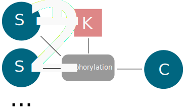
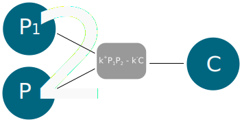

Presentation
============

This section presents the basics element to understand the structure of the algorithm and
the role of the various python module.

## An algorithm overview

There is three main blocs in the algorithm that correspond to the three library presents
at the root of the project.

- *Networks*: gather all the elements to represent, modify and simulate the biological
networks that are the various indidividuals of our population.
- *Population_types*: implements the so-called genetic algorithm and its several variants
- *AnalysisTools*: gather the tools used after the simulation to analyse, represent and
study its results.

## Network components

*Network* (and its sub-class *Mutable_Network*) represent the individual levels of our
evolutionnary algorithm. Apart of the methods used to implement the different operations,
the main attribute is *graph*, a networkx.MultiDiGraph object that stores the biochemical
network as a bipartite graph of *Species* (and *TModule*) on one side and *Interaction* on
the other. The organisation of the graph thus relies on the [networkx
package](https://networkx.github.io/).

The subclass called *MutableNetwork* handles the mutations in the *Network*

The *deriv2* module is responsible for reading a *Network*'s  interactions and to generate a C file with the species differencial equation used for the integration and compute the fitness of
the network that will be used at the genetic algorithm level.

### Species

Species is one of the two major components of a network. A species is a protein that can
have different types (Degradable, Phosphorylable, etc.). Adding a new type requires a list
containing the type name as a first element and the different parameters (if any) must
complete the list in a pre-defined order. For instance a degradable species comes with its
degradation rate.

Most of the former attributes are handled internally, but nothing prevent us from adding a type manually:

``` python
mySpecies.add_type(["Degradation",0.5])
print(mySpecies.dict_types())
```

Species may also be added or deleted manually from the Network, but adding a single Species
is actually quite rare as they often came as a whole gene with a CorePromoter and a TModule
(see the TModule picture below).

``` python
mySpecies = my_Network.new_Species(["Degradation",0.5])
mySpecies = my_Network.new_gene(rate, delay,["Degradation",0.5],basal_rate)
```

### Interaction

The Interactions, as suggested by its name, accounts for how species and TModules
interact. Examples of interactions are protein-protein interactions, transcription factor
regulations, etc. See the sections below for various type of preimplemented interactions.

Note also that it is often necessary to implement new interactions tailored for
a specific task. (See Examples/immune/ for an example of such new interactions.)

### TModule

A TModule is the last type of network component. It models for the transcription part of a gene and are connected to the species they control via a CorePromoter interaction. I φ-evo's framework, a gene is represented by the three components *TModule*, *CorePromoter*, and *Species*.

The transcription factor species that regulate a gene are connected to the Tmodule.

{.align-center width="500px"}

## Evolution

The evolution algorithm mimics Darwinian selection. It generates an initial population (of constant size size defined by the user) where the individuals are in competition to pass their genome to the next generation.
The algorithm thus follow a cycle of mutation, fitness computation and selection. Each cycle
thus defines our time step of evolution and will subsequently be called a generation.

### Elite strategy

By default we use the more robust and less computationnaly costly strategy of genetic
algorithm, the *elite strategy*. During the selection step, the worst part of the
population is deleted, while the fittest half of the individuals are directly passed to
the next generation. Then, each of themis copied and this copy is mutated. Note that this
scheme automatically keep constant the population size and depend only on the rank of the
individuals in the population and not on the quantitative fitness which make it robust to
the possible failure of the fitness implementation.

### Pareto evolution

In the case where the fitness is composed of multiple components, it is not obvious how to balance the different modules in the global fitness. It may be interesting to have a multiple objective optimization where all the components have the same importance; only changes improving a component without decreasing the others are kept. The fitness $F = \{f_1,f_2,...,f_N\}$ is of higher rank than $G = \{g_1,g_2,...,g_N\}$ if
$$\forall i\quad f_i\geq g_i$$
$$\exists k,\quad f_k>g_k$$

Clearly multiple objective optimisation does not result in one best network in the end but to a population of highest rank networks called the Pareto front. More information can be found on [Wikipedia](https://en.wikipedia.org/wiki/Multi-objective_optimization).

From a practical standpoint, the algorithm works similarly to the genetic algorithm with a modified selection process. As in the genetic algorithm, half of the population is passed to the next generation and duplicated. Because the only classification criterion is the network's rank, the cutoff may occur in the middle of a set of equivalent network since they have the same rank. In such a case the algorithm selects randomly the networks with the cutoff rank to complete the set of individuals passed to the next generation.

## Modelization & Integration

To simulate the dynamics of a species the program first needs to
explore the nodes and the interactions that are connected and to build the equations that govern the dynamic of the its concentration. The equations are exported to c code and integrated.

The following examples presents networks components are converted into ordinary differential equations.

### TModule and gene production

There exists two types of TF actions: activition and inhibition. Both types are modelled using Hill functions but there their effects is included differently to the global regulation. Only the maximum of all the activation is accounted for whereas the inhibitions are multiplicative. In some extend activation and repression work respectively as OR and NAND logic gates.

Next the CorePromoter interaction adds a delay $\tau_P$ to accounts for
the protein synthesis time. Practically, the algorithm considers the
state of the system at time $t-\tau_P$ to estimate the production of $P$
at time $t$.

The following configuration

{.align-center width="500px"}

leads to the equation

$$\frac{d S}{d t} = \left(\max\left\{PR_S \times\max\left\{\frac{A_1^{n_{A1}}}{A_1^{n_{A1}} + h_{A1}^{n_{A1}}}, \frac{A_2^{n_{A2}}}{A_2^{n_{A2}} + h_{A2}^{n_{A2}}}, \ldots \right\},B_S\right \}\times \frac{h_{R1}^{n_{R1}}}{R_1^{n_{R1}} + h_{R1}^{n_{R1}}} \times \ldots \right)_{(t-d_S)}$$

__

In the above equation, the $h$ and $n$ parameters correspond
respectively to the hill saturation and exponent. The $PR$ is the
production rate of the protein in optimal conditions and $B$ is the
basal rate(in case no activator is present). The overall production is
modulated by the repression.

### Degradation

Every protein $P$ labelled as *degradable* is degraded over time with a
rate $\delta_P$. This

$$\frac{d P}{d t} =  - \delta_P P$$

### Phosphorylation

The phosphorilasion is the addition of a phosphate group to a Species by
a kinase. It creates a new phophorilated species. The dynamics of this
mechanism is controlled by a hill function that accounts for the use of
the kinase by all the different species. In the case of of kinase that
catalyses the phosphorilation of two species $S_1$ and $S_2$.

$$\frac{d S_1}{dt} = - \frac{d S_1^{*}}{dt} = k_p^1\frac{K \left(\frac{S_1}{h_1}\right)^{n_1}}{1+\left(\frac{S_1}{h_1}\right)^{n_1} + \left(\frac{S_2}{h_2}\right)^{n_2}} - k_d^1 S_1^{*}$$

$$\frac{d S_2}{dt} = - \frac{d S_2^{*}}{dt} = k_p^2\frac{K \left(\frac{S_2}{h_2}\right)^{n_2}}{1+\left(\frac{S_1}{h_1}\right)^{n_1} + \left(\frac{S_2}{h_2}\right)^{n_2}} - k_d^2 S_2^{*}$$


{.align-center width="300px"}

### Protein-Protein-Interaction (PPI)

The PPI interaction accounts for the complexation of two single proteins
into one complex.

{.align-center width="300px"}

The rate is obtained from a mass-action dynamics:

$$\frac{d P_1}{dt} = \frac{d P_2}{dt} = - \frac{d C}{dt} = - \text{rate} = - k^{+}P_1P_2 + k^{-} C$$

with $k^{+}$ and $k^{-}$ being respectively the forward and backward
rate constants
