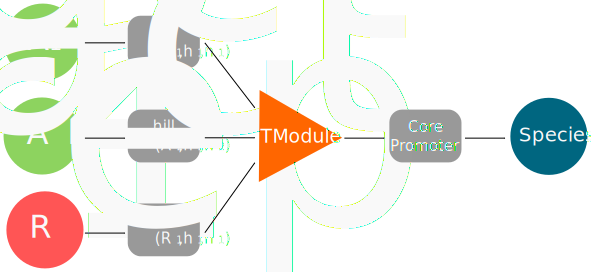
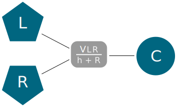

Presentation
============

This section presents the basic

## Network components


### Species

Species is one of the two major components of a network. A species is a
protein that can have different functions. Adding a new type requires a
list containing the type name as a first element. Some type may come
with characteristic parameters that complete the list. A species is
described by one or more of the following tags:

Most of the former attributes are handled internally. If the user wants
can to enter a type manually, it is done through:

``` {.sourceCode .python}
mySpecies.add_type(["Degradation",0.5])
print(mySpecies.list_types())
```

### TModule

A TModule is a third type of network component along with species\_ and
interactions\_ that has not been mentioned yet. It is an artificial
element introduced to allow the regulation of a species\_ production by
more than one transcription factor (TF). One, two or more can enhance or
repress the production of a species, those a linked to the TModule using
a [TFHill](interaction_) interaction. The TModule itself is linked to
the synthetized species by an interaction named CorePromoter. During the
model export, the program will gather all the information contained in
the interactions suroundong the module en use them to generate the
governing equation of the species that is produced.

{.align-center width="500px"}

### Interaction

The Interactions serve as links between other species\_ and TModules\_.
The different interactions are:

### Network

The network class is a container that can accomodate its different
Components (species\_, TModules\_, and interactions\_). A network is
encoded using a biparpatite graph where species\_ one hand are connected
to [interactions](interaction_) on the other hand. In fact the three
types of components are represented by nodes from the [networkx
package](https://networkx.github.io/) in the network's graph.

The inherited class **Mutable\_Network** is used when running an *in
silico* evolution.

The time course of the species is obtained after compilation step where
the program indexes the components and their parameters to produce a set
of delayed differential equations.

### Dynamical components

To simulate the dynamics of the species the program first need to
explore the nodes and the interactions\_ that are connected to it in
order to build the equations that govern the dynamic of the
concentrations. Once the equations are set, the equations are exported
to c code and integrated. The following examples presents networks
components are converted into ordinary differential equations.

#### TModule

There exists two types of TF actions: activition and inhibition. The
regulation of a TF on its target is applied through Hill functions. In
addition, activation and inhibition are treated differently. Repression
on the product synthesis are multiplicatives, namely the total
inhibition is the product of every single inhibition by TFs whereas only
the maximal activation is relevant for the overall protein production.
In some extend activation and repression work respectively as OR and
NAND logic gates.

Next the CorePromoter interaction adds a delay $\tau_P$ to account for
the protein synthesis time. Practically, the algorithm considers the
state of the system at time $t-\tau_P$ to estimate the production of $P$
at time $t$.

The following configuration

{.align-center width="500px"}

leads to the equation

$$\frac{d S}{d t} = \left(\max\left\{r_S \times\max\left\{\frac{A_1^{n_{A1}}}{A_1^{n_{A1}} + h_{A1}^{n_{A1}}}, \frac{A_2^{n_{A2}}}{A_2^{n_{A2}} + h_{A2}^{n_{A2}}}, \ldots \right\},b_S\right \}\times \frac{h_{R1}^{n_{R1}}}{R_1^{n_{R1}} + h_{R1}^{n_{R1}}} \times \ldots \right)_{(t-d_S)}$$

__

In the above equation, the $h$ and $n$ parameters correspond
respectively to the hill saturation and exponent. The $PR$ is the
production rate of the protein in optimal conditions and $B$ is the
basal rate(in case no activator is present). The overall production is
modulated by the repression.

#### Degradation

Every protein $P$ labelled as *degradable* is degraded over time with a
rate $\delta_P$. This

$$\frac{d P}{d t} =  - \delta_P P$$

#### Phosphorylation

The phosphorilasion is the addition of a phosphate group to a Species by
a kinase. It creates a new phophorilated species. The dynamics of this
mechanism is controlled by a hill function that accounts for the use of
the kinase by all the different species. In the case of of kinase that
catalyses the phosphorilation of two species $S_1$ and $S_2$.

$$\frac{d S_1}{dt} = - \frac{d S_1^{*}}{dt} = - \frac{A\times Ki}{1 + (S_1/h_1)^{n_1} + (S_2/h_2)^{n_2}} + \delta S_1^{*}$$$$\frac{d S_2}{dt} = - \frac{d S_2^{*}}{dt} = - \frac{A\times Ki}{1 + (S_1/h_1)^{n_1} + (S_2/h_2)^{n_2}} + \delta S_2^{*}$$

{.align-center width="300px"}

#### Protein-Protein-Interaction (PPI)

The PPI interaction accounts for the complexation of two single proteins
into one complex.

{.align-center width="300px"}

The rate is obtained from a mass-action dynamics:

$$\frac{d P_1}{dt} = \frac{d P_2}{dt} = - \frac{d C}{dt} = - \text{rate} = - k^{+}P_1P_2 + k^{-} C$$

with $k^{+}$ and $k^{-}$ being respectively the forward and backward
rate constants

#### Ligand-Receptor interaction (LR)

This interaction corresponds to the complexation of two species - a
ligand and a receptor - to trigger a response in the system.

{.align-center width="300px"}

The ligand concentration are assumed to be add steady state which allows
to describe the rate using the *Michaelis-Menten-Henri* formalism:

$$\frac{d L}{dt} = \frac{d R}{dt} = - \frac{d C}{dt} = - \text{rate} = - \frac{V\,L\,R}{h + R}$$

with $V$ and $h$ being respectively the association rate and the
association threshold.

## Evolution

The evolution algorithm mimics Darwinian selection. It generates an initial population (of constant size size defined by the user) where the individuals are in competition to pass their genome to the next generation. Only the fittest half of the individuals passes to next generation and is allowed do reproduce (by duplication) in order to maintain the population size. 
